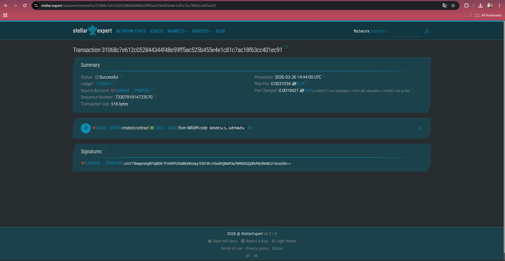

# Class Leader Voting DApp

**Class Leader Voting DApp** - Decentralized Voting System

## Project Description

Class Leader Voting DApp is a decentralized voting application built on the Stellar blockchain using Soroban SDK.

This smart contract allows users to create candidates, vote for them, and view voting results directly on-chain. All data is stored transparently and immutably, ensuring fairness and trust without relying on a centralized authority.

## Project Vision

Our vision is to build a fair and transparent voting system by:

- Eliminating centralized control in voting
- Ensuring vote transparency and immutability
- Preventing manipulation or fraud
- Empowering users in a decentralized system

## Key Features

### 1. Candidate Creation

- Add new candidates
- Unique ID generation
- Initial vote count = 0

### 2. Voting System

- Vote for candidate by ID
- Vote count increases securely

### 3. View Candidates

- Retrieve all candidates and vote counts

### 4. Delete Candidate

- Remove candidate from storage

## Contract Details

- Contract Address: CAKDJ4PVOTTR7CGGJVJVKYEZE3EELSBXQGMSITMTKX62WL5UD3OJKWQ
  

## Future Scope

## Future Scope

### Short-Term Enhancements

- Implement one wallet = one vote system to prevent duplicate voting
- Add voting deadline (time limit for voting)
- Add candidate description (profile or additional information)

### Medium-Term Development

- Integrate frontend using React and Freighter Wallet
- Enable wallet-based authentication (no username/password)
- Display real-time voting results

### Long-Term Vision

- Implement DAO-based voting system (Decentralized Autonomous Organization)
- Support multiple elections in one system
- Enable cross-chain voting integration

## Enterprise Features

### 1. Institutional Voting System

- Can be used for school, university, or organizational elections
- Supports large-scale voting with many participants

### 2. Secure Audit Trail

- All voting activities are recorded on blockchain
- Enables transparent and verifiable audit process

### 3. Role-Based Access Control

- Admin can manage candidates and election settings
- Users can only vote without modifying system data

### 4. Multi-Election Management

- Support multiple voting events within one system
- Separate elections for different classes or groups

### 5. Automated Reporting

- Generate real-time voting results
- Provide analytics for decision-making

### 6. Integration with Identity Systems

- Can be integrated with student or employee ID systems
- Ensures only eligible users can vote

---

## Technical Requirements

- Rust programming language
- Soroban SDK (Stellar Smart Contract framework)
- Stellar CLI
- Stellar Testnet
- Freighter Wallet (for interaction and testing)
- Cargo (Rust package manager)

## Getting Started

Deploy the smart contract to Stellar's Soroban network and interact with it using the main functions:

- `create_candidate()` - Create a new candidate
- `get_candidates()` - Retrieve all candidates
- `vote()` - Vote for a candidate by ID
- `delete_candidate()` - Remove a candidate by ID

---

**Stellar Notes DApp** - Securing Your Thoughts on the Blockchain
